# Cognita — AI Learning & Assessment Platform

Cognita is an AI platform where **teachers and students** create topic-based assessments, and
students **learn from their own documents**: upload a PDF/text file and Cognita loads → chunks →
embeds → stores it for **RAG**, so you can **chat with the document**, generate **summaries &
flashcards**, **take assessments** and get **AI-graded feedback**, all tracked in **analytics
dashboards**.

Built as a **Turborepo + Bun** monorepo: **Next.js 15** frontend and a **Node/Express** API, with
**LangChain** behind a multi-provider **LLM Gateway**, **Qdrant** for vectors, **Postgres + Prisma**
for data, **Redis + BullMQ** for background jobs, and **Auth.js** for authentication.

---

## Why this architecture (rate/token-limit resilience)

The original demo dumped the first 3000 characters of an uploaded file straight into the prompt and
hand-parsed the JSON — fragile, and it blew the context window on large files. Cognita fixes that:

1. **LLM Gateway with failover** — LangChain `ChatOpenAI` clients for free models on
   **OpenRouter → Mistral → Groq**; `.withFallbacks()` auto-rolls to the next provider on a
   `429`/error. Set the order with `LLM_PROVIDER_ORDER`.
2. **RAG retrieval** — only the top-k relevant chunks are sent to the model, not the whole document.
3. **Local embeddings** (`fastembed`, `all-MiniLM-L6-v2`, onnxruntime) — no embedding API, so no
   embedding rate limits or cost.
4. **Robust structured output** — JSON extraction + a self-repair pass replaces brittle parsing.
5. **Redis caching** of completed assessments; **BullMQ** queues with concurrency caps + backoff.

---

## Architecture

```
Next.js (Auth.js)  ──Bearer JWT──▶  Express API  ──▶  LangChain LLM Gateway ─▶ OpenRouter│Mistral│Groq
      │                                  │
      │                                  ├─▶ Postgres (Prisma): users, documents, assessments,
      │                                  │                      submissions, grades, chat, study
      │                                  ├─▶ Qdrant: document chunk embeddings (RAG)
      │                                  └─▶ Redis + BullMQ: generation / ingestion / grading jobs
      └── WebSocket (generation progress) + SSE (streaming tutor chat)
```

Auth bridge: the Next.js Auth.js app mints an **HS256 JWT** (`session.apiToken`, signed with the
shared `AUTH_SECRET`) that the Express API verifies with `jose`; routes are guarded by role.

---

## Features

- **Tutor chat (chat-with-PDF, RAG)** — ask questions answered *only* from your document, with inline
  citations, streamed token-by-token over SSE.
- **Assessment generation** — teachers/students generate formal papers from a topic, optionally
  grounded in an uploaded document via RAG. Real-time progress over WebSockets.
- **Auto-grading + feedback** — MCQ/true-false/exact answers graded deterministically; short/long
  answers graded by the LLM with per-question feedback.
- **Study aids** — AI summaries, key points, and flashcards generated from a document.
- **Analytics** — teacher (assessment stats, submissions) and student (progress, scores, activity).
- **PDF export** — Student paper vs Teacher answer key via `@react-pdf/renderer`.
- **Polished UI** — Tailwind v4, GSAP animations, Locomotive smooth scroll.

---

## Tech stack

| Layer        | Choice |
|--------------|--------|
| Monorepo     | Turborepo, Bun workspaces |
| Frontend     | Next.js 15 (App Router), React 19, TypeScript, Tailwind v4, GSAP, Locomotive Scroll |
| Auth         | Auth.js (NextAuth v5) + Prisma adapter, JWT sessions |
| Backend      | Node/Express, TypeScript |
| AI           | LangChain (`@langchain/openai`, `@langchain/qdrant`, text splitters) |
| LLM Gateway  | OpenRouter / Mistral / Groq (free models) with automatic failover |
| Embeddings   | `fastembed` (local, onnxruntime, all-MiniLM-L6-v2) |
| Vector store | Qdrant |
| Database     | Postgres + Prisma |
| Jobs/cache   | Redis + BullMQ |

---

## 📷 Application Walkthrough & UI Gallery

Here is the visual step-by-step walkthrough of the Cognita platform:

### 👩‍🏫 Teacher Workspace & Assessment Flow

| **1. Landing Page (GSAP animated)** | **2. Create Assessment (Step 1)** |
|:---:|:---:|
| 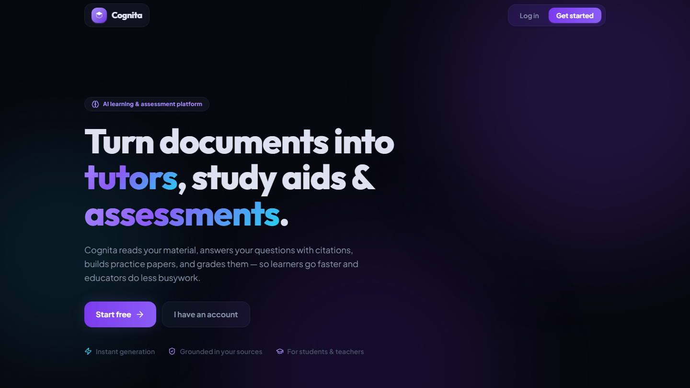 | 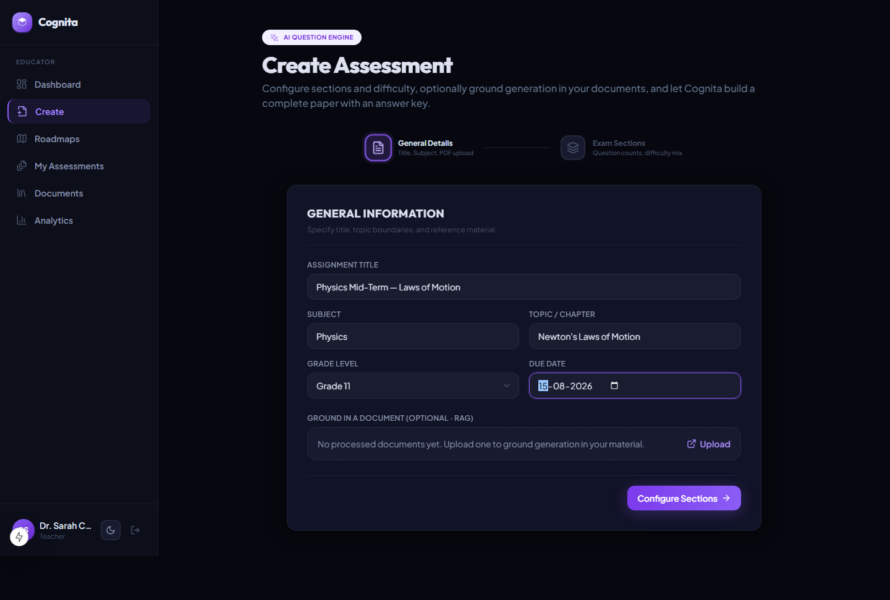 |

| **3. Configure Sections (Step 2)** | **4. Teacher Dashboard** |
|:---:|:---:|
| 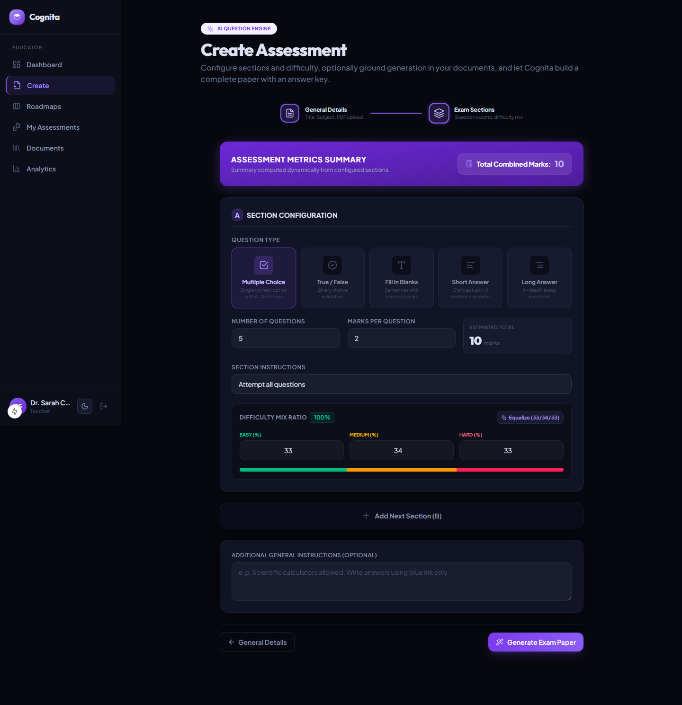 | 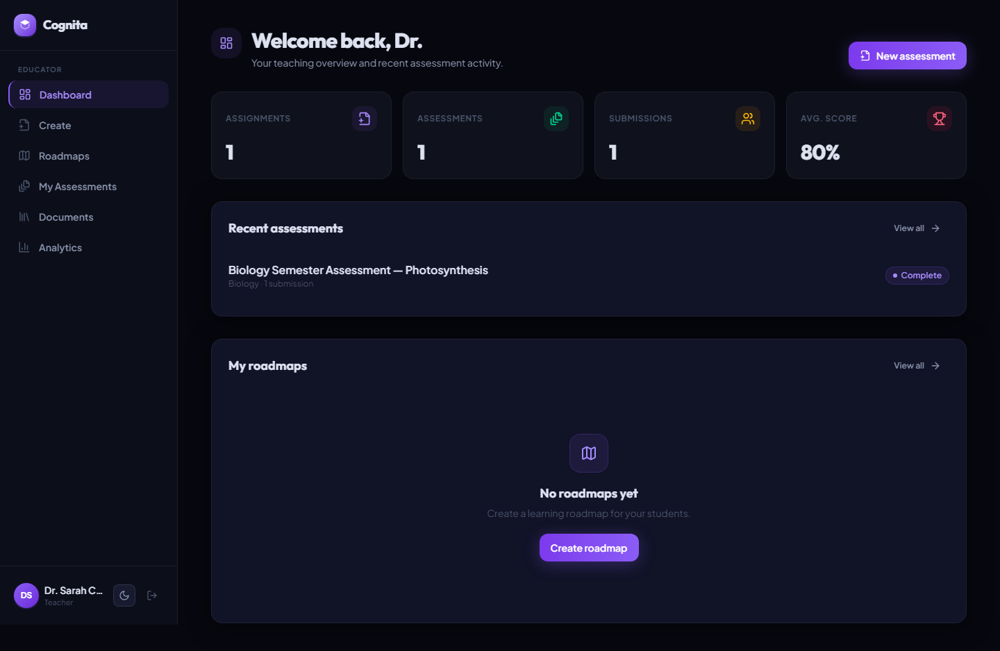 |

| **5. Teacher Assessment Detail** | **6. Teacher Answer Key** |
|:---:|:---:|
| 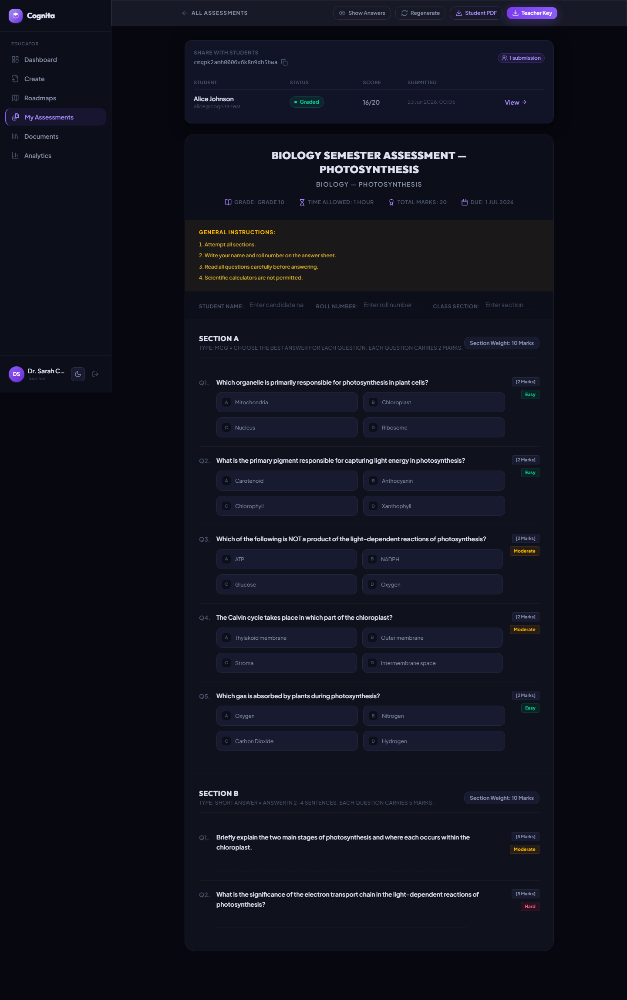 | 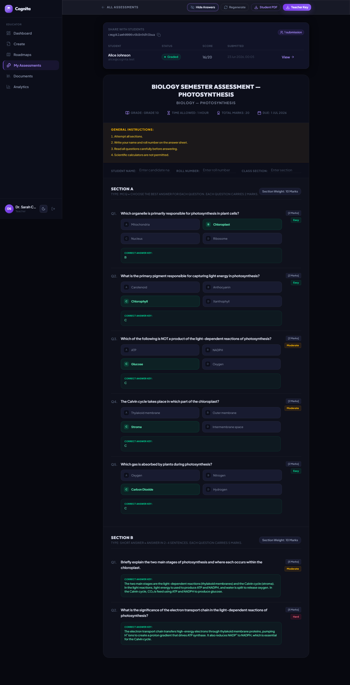 |

| **7. Analytics Dashboard** | **8. Teacher Library** |
|:---:|:---:|
| 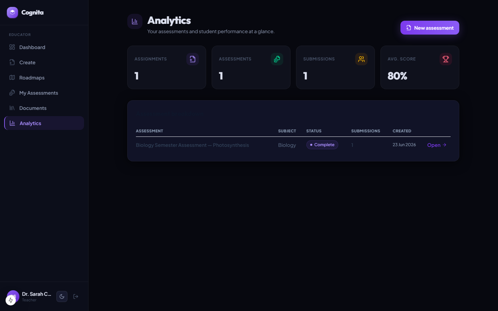 | 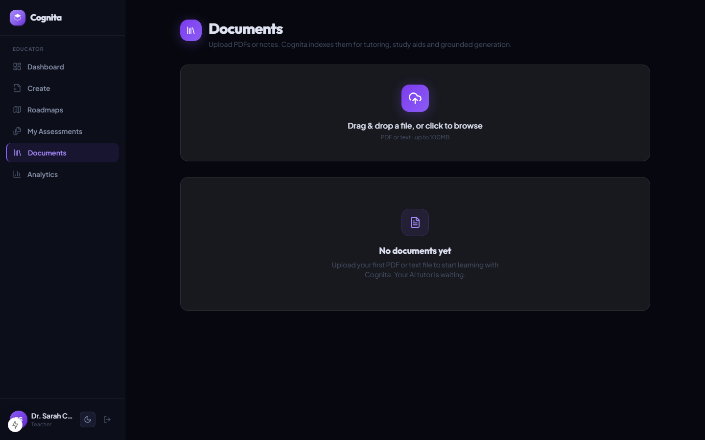 |

### 🧑‍🎓 Student Workspace & Learning Flow

| **9. Student Dashboard** | **10. Student Library** |
|:---:|:---:|
| 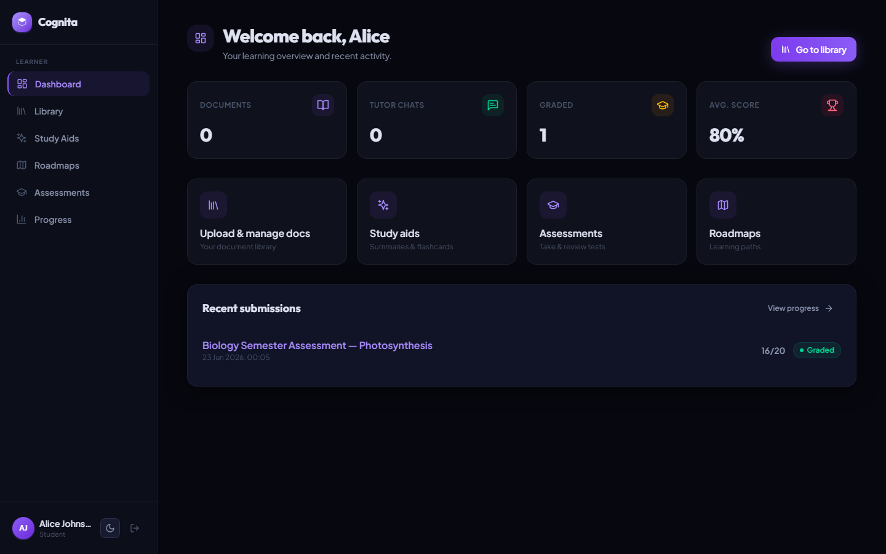 |  |

| **11. AI Study Aids (Flashcards)** | **12. Student Assessments View** |
|:---:|:---:|
| 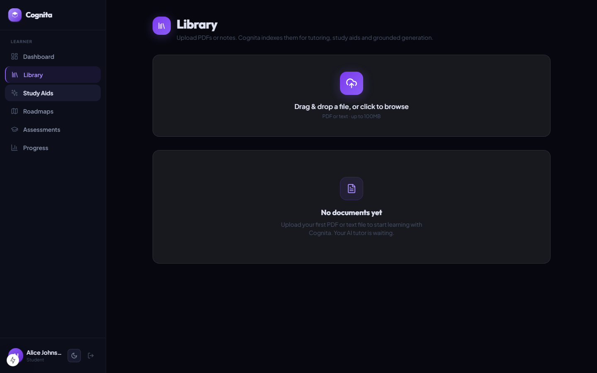 | 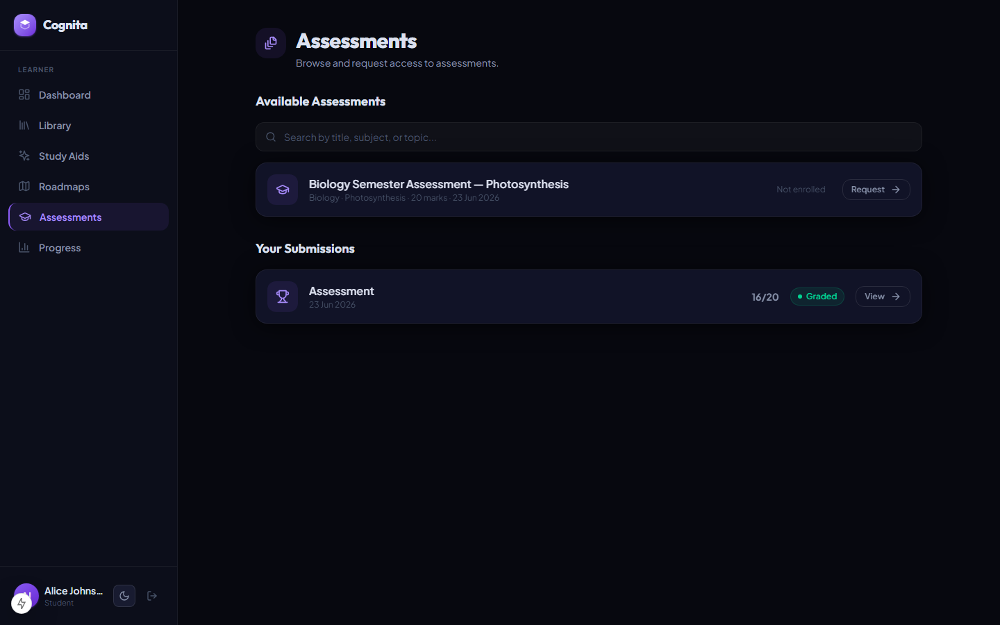 |

| **13. Graded Assessment Feedback** | **14. Detailed Scorecard Review** |
|:---:|:---:|
| 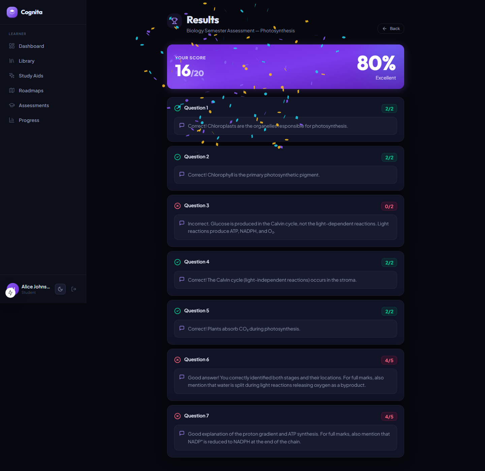 | 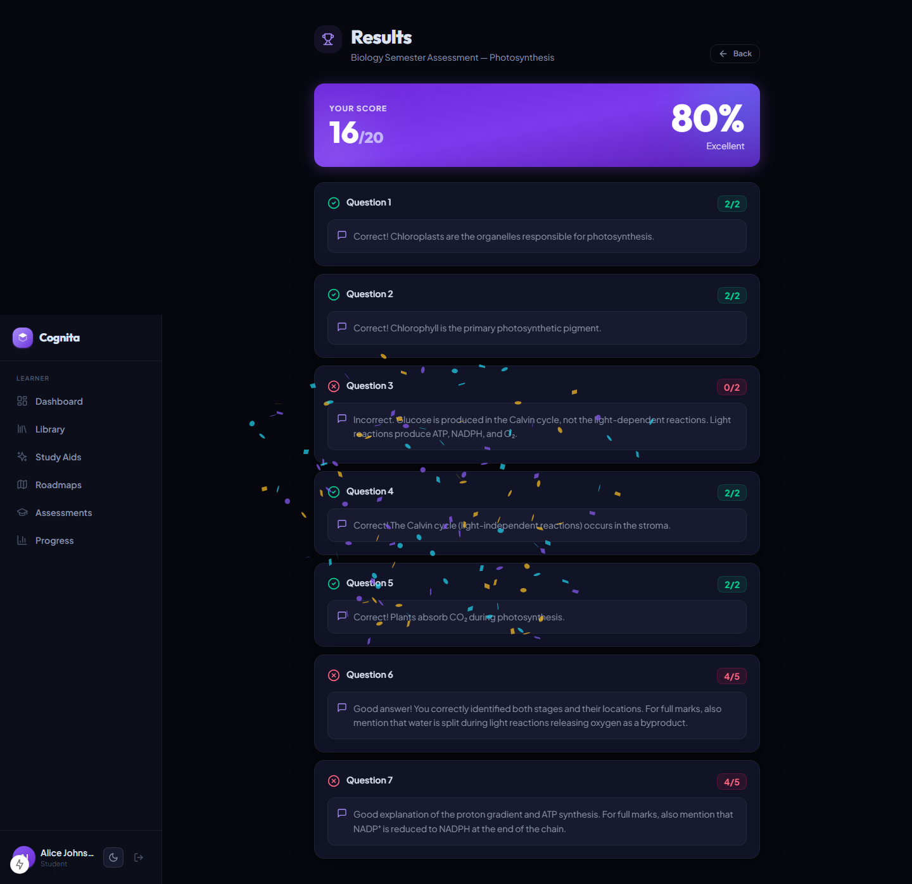 |

| **15. Progress Tracker** |
|:---:|
| 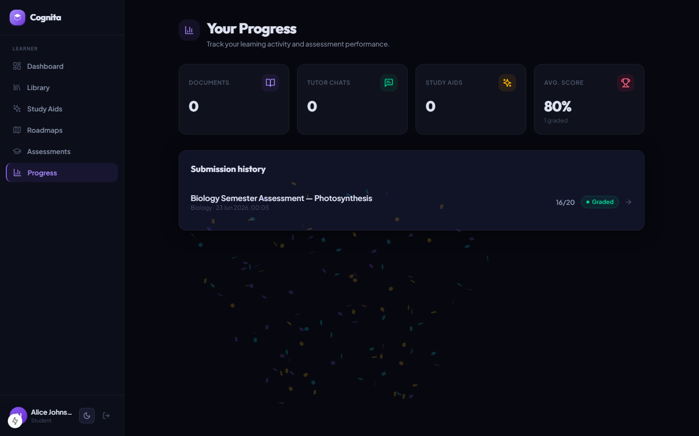 |

---

## Local setup

### 1. Prerequisites
**Bun** (v1.x+), **Node 20+**, and **Docker Desktop** running.

### 2. Start infrastructure (Postgres + Qdrant + Redis)
```bash
docker compose up -d
```

### 3. Environment
```bash
cp .env.example apps/api/.env
cp .env.example apps/web/.env.local   # keep only the frontend section in this one
```
Set a strong `AUTH_SECRET` (the **same value** in both files) and add at least one LLM key:

| Provider   | Get a free key                | Env vars |
|------------|-------------------------------|----------|
| OpenRouter | https://openrouter.ai/        | `OPENROUTER_API_KEY`, `OPENROUTER_MODEL` |
| Mistral    | https://console.mistral.ai/   | `MISTRAL_API_KEY`, `MISTRAL_MODEL` |
| Groq       | https://console.groq.com/     | `GROQ_API_KEY`, `GROQ_MODEL` |

Failover order is `LLM_PROVIDER_ORDER` (default `openrouter,mistral,groq`). Providers with no key are
skipped; with no keys at all, the app runs assessment generation in a **mock** mode.

### 4. Install dependencies
```bash
bun install
```

### 5. Database
```bash
cd apps/api && bunx prisma migrate dev   # creates tables; then back to repo root
```

### 6. Run
```bash
bun run dev      # web on :3000, api on :8000
```
On first run the local embedding model (~90 MB) downloads and is cached. Register a user at
`/register` (choose Student or Teacher).

---

## Project structure

```
apps/
├── api/                         # Express + LangChain + Prisma
│   ├── prisma/schema.prisma     # Postgres schema (users, docs, assessments, submissions, chat, study)
│   └── src/
│       ├── llm/                 # providers.ts + gateway.ts (failover + structured JSON)
│       ├── rag/                 # embeddings, vectorstore (Qdrant), ingest, retrieval
│       ├── chains/              # assessment / tutor / grading / study chains
│       ├── routes/              # documents, tutor, assignments, assessments, submissions, study, analytics
│       ├── queues/ + workers/   # BullMQ generation / ingestion / grading
│       ├── middleware/auth.ts   # verifies Auth.js JWT (jose)
│       └── services/            # pdf.service, websocket.service
└── web/                         # Next.js 15 (Auth.js, GSAP, Locomotive, dashboards, tutor, study)
```

---

## Notes
- **Embeddings use `fastembed`, not `@xenova/transformers`** (the latter pulls `sharp`, which has no
  prebuilt for Node 22 and needs a C++ toolchain on Windows).
- Root `package.json` pins `ioredis`/`bullmq` via `overrides` to avoid duplicate-copy type conflicts.
- If the LLM returns `401 User not found`, your OpenRouter key is invalid — add a valid key or a
  Groq/Mistral key; the gateway will fail over to whichever providers are configured.
